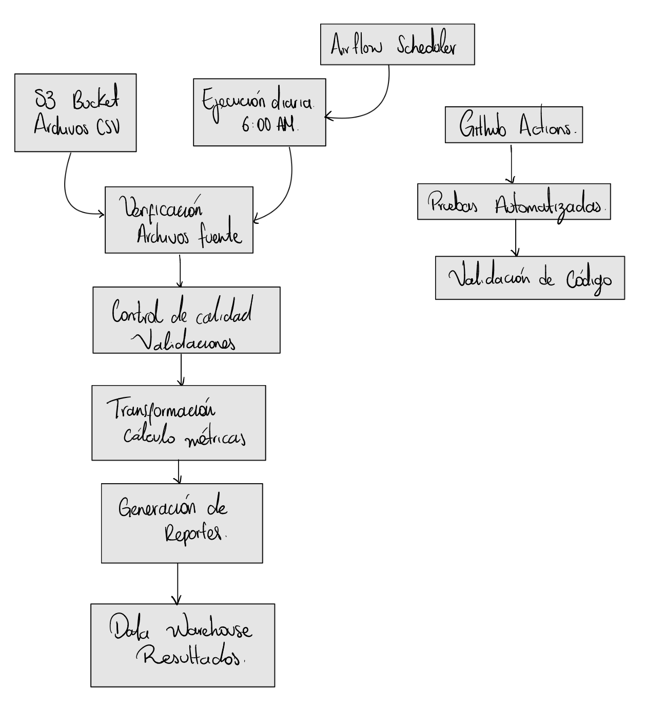

# DataShop Data Pipeline - Sistema de Procesamiento Diario

## Descripción del Proyecto
Pipeline de datos automatizado para DataShop que genera informes diarios de ventas implementando prácticas DataOps. El sistema procesa archivos CSV de órdenes y clientes para calcular métricas críticas de negocio de manera automatizada y confiable.

## Respuestas de las Preguntas Teóricas

### Importancia de la Automatización en el Ciclo de Vida de los Datos
La automatización es fundamental porque elimina errores humanos en procesos repetitivos, asegura consistencia en el procesamiento y permite manejar grandes volúmenes de datos eficientemente. En nuestro caso, la automatización facilita la reproducibilidad de pipelines y permite monitoreo continuo con detección temprana de problemas. Sin automatización, los equipos gastarían tiempo valioso en tareas manuales propensas a errores en lugar de enfocarse en análisis de valor.

### Contribución del Enfoque Colaborativo a la Calidad de Datos
La colaboración entre ingenieros de datos y científicos de datos mejora la calidad mediante la combinación de perspectivas complementarias. Los científicos entienden los requisitos analíticos y las necesidades de negocio, mientras los ingenieros implementan soluciones escalables y mantenibles. Las revisiones cruzadas detectan errores temprano, la documentación compartida facilita el mantenimiento y el feedback continuo asegura que el pipeline evolucione según las necesidades cambiantes del negocio.

## Arquitectura del Sistema

   

### Métricas Calculadas
Ventas totales del día anterior agregando todas las transacciones. Top 5 productos más vendidos basado en cantidad de unidades. Cliente con la compra más grande del día identificado por el monto total gastado.

### Componentes Técnicos
## Scripts de Procesamiento
Transformación principal en scripts/transform.py que lee archivos CSV, calcula métricas y genera reportes en JSON/CSV. Control de calidad en scripts/data_quality_check.py que valida estructura de datos, valores nulos, positividad de cantidades y precios, y unicidad de identificadores.

## Orquestación con Airflow
DAG programado para ejecución diaria con cuatro tareas secuenciales. Verificación de archivos fuente antes del procesamiento. Ejecución de controles de calidad que detienen el pipeline si fallan. Transformación de datos y generación de métricas. Carga simulada de resultados con logging detallado.

## Pruebas Automatizadas
Suite de pruebas unitarias que verifica cálculos de ventas totales. Validación de identificación correcta del producto más vendido. Pruebas de manejo de datos vacíos y escenarios edge. Pruebas de calidad de datos con datos válidos e inválidos.

## Integración Continua
GitHub Actions configura pruebas automáticas en cada push. Instalación automática de dependencias y ejecución de pytest. Validación de cobertura de código y formato con flake8/black.

## Configuración e Instalación
Requisitos: Python 3.9+, Apache Airflow 2.5+, pandas 1.5+. Instalación con pip install -r requirements.txt. Inicialización de base de datos Airflow con airflow db init. Usuario administrador creado con airflow users create. Servicios iniciados con airflow webserver y airflow scheduler.

## Estructura de Archivos
datashop-data-pipeline/ contiene scripts/ para transformación y calidad. tests/ para pruebas unitarias y de integración. dags/ para definición del pipeline Airflow. data/input/ para archivos CSV fuente. data/output/ para reportes generados. .github/workflows/ para configuración CI/CD.

## Ejecución y Monitoreo
Pruebas ejecutadas con pytest tests/ -v. Pipeline local ejecutado con python scripts/transform.py. DAG probado con airflow dags test datashop_daily_pipeline. Monitoreo mediante Airflow UI en puerto 8080. Verificación de CI/CD en pestaña GitHub Actions.

## Flujo de Trabajo Colaborativo
Desarrollo en ramas feature con pull requests. Revisiones de código requeridas antes de merge. Pruebas automáticas en cada commit. Documentación actualizada en README. Deployment automático tras aprobación.

## Manejo de Errores
Validaciones de calidad detienen pipeline con mensajes claros. Reintentos automáticos configurados en Airflow. Logging detallado en cada etapa del proceso. Notificaciones de falla mediante excepciones específicas.

## Escalabilidad y Mantenimiento
Diseño modular permite agregar nuevas métricas fácilmente. Configuración centralizada en requirements.txt. Pruebas comprehensivas facilitan refactorización. Documentación técnica incluida en cada componente.

## Entregables del Proyecto

Código funcional que incluye script de transformación en scripts/transform.py. Script de control de calidad en scripts/data_quality_check.py. Suite de pruebas unitarias en tests/ que pasa al 100%. DAG de Airflow en dags/datashop_daily_pipeline.py. Configuración de GitHub Actions en .github/workflows/test.yml.

Documentación completa con README.md claro y diagramas de arquitectura. requirements.txt con todas las dependencias del proyecto. Estructura de carpetas organizada y estandarizada.

Evidencia de funcionamiento con capturas de pantalla del UI de Airflow mostrando ejecución exitosa. Capturas de la pestaña Actions de GitHub mostrando tests pasados. Logs de ejecución con métricas calculadas correctamente.

## Conclusión

Este proyecto demuestra la implementación práctica de principios DataOps en un pipeline de datos para e-commerce. La automatización, colaboración y calidad de datos están integradas en cada fase del ciclo de vida. 

---

**Repositorio**: github.com/Miguelhv27/datashop-data-pipeline 